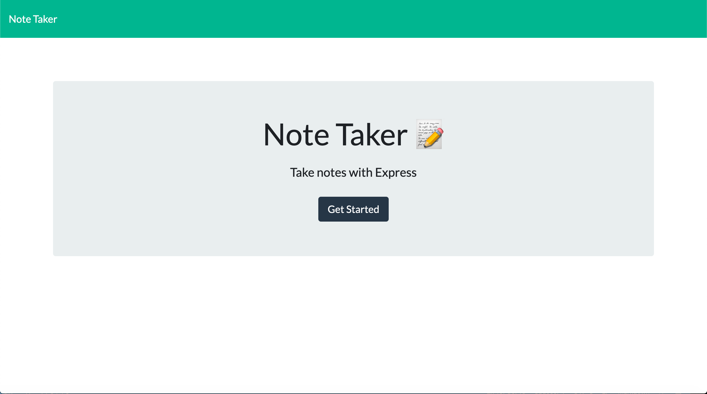
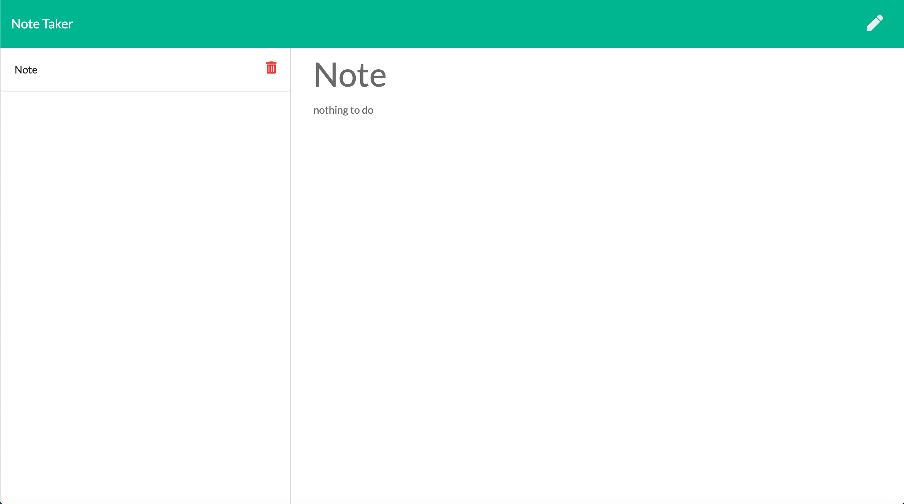
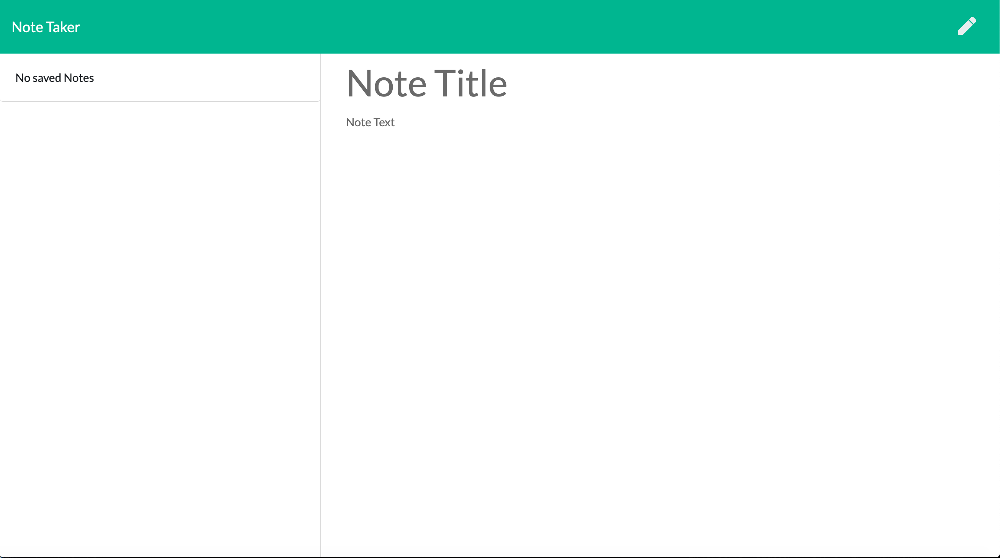

# Note Taker
# Description
This Project is made so the user will be able to write and save notes. 

To organize the users thoughts and keep track of the task that is needed to be done. 

In this project, the user can write the note and save it and then he/she can view the note at the left hand side of the page and has the option to delete the notes if he/she finish the task or dont want that note anymore.

This is also some of the photo of the deployed project.

The Project can be also be viewed [here](https://evening-earth-10037.herokuapp.com/).

# Table Of Contents
Please click on the selection if you want to see a specific part of this README.
  * [Description](#description)
  * [Installation](#installation)
  * [Usage](#usage)
  * [License](#license)
  * [Contributing](#contributing)
  * [Tests](#tests)
  * [Questions](#questions)
# Installation
npm install
# Usage
node index.js
# Licence 
MIT
# Contributors
Grace Palenzuela
# Test 
none
# Questions 
 
For more information you can check my Github account gracee19(https://github.com/gracee19). 
